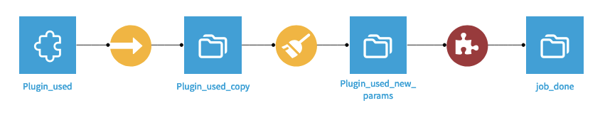
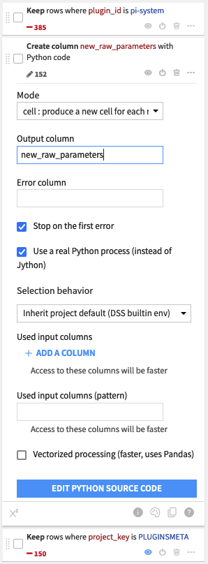
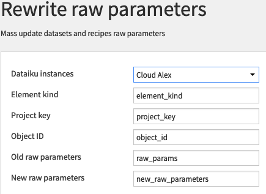
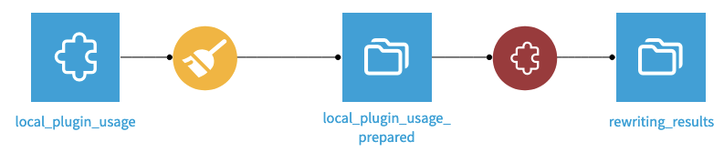
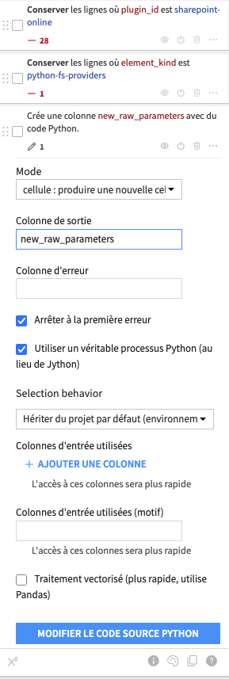
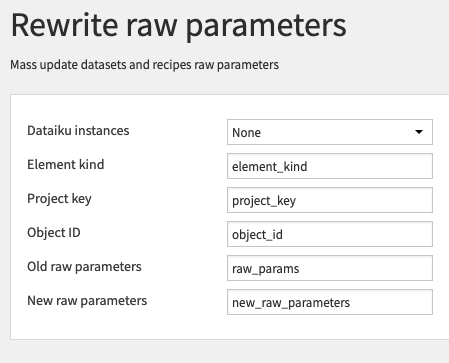

# DSS Plugin Handler

## Installation

After download, as a Dataiku admin, add a preset per Dataiku instance that needs to be remotely processed. 
- Go to Apps > Plugins > Installed > Plugin handler > Settings > Dataiku instances > Add Preset
- Add the full URL (including port number) to the Dataiku instance and its API key
- Grant access to the appropriate groups

## Retrieve plugin usage for all your instances

- In the flow, press +Dataset > Plugin Handler > Plugin usage
- Add and select as many instances presets as necesssary
- Press Test & get schema

## Rewrite datasets and recipes parameters

Parameters for datasets and/or recipes present in existing flows can be mass-changed using this plugin `Rewrite raw parameters` recipe.

The flow below gives an example of URL being changed in datasets and recipes used by the pi-system plugin.



- All the plugins usages of the instance(s) are first extracted in the `Plugin_used` dataset, using this plugin's `Plugin usage` dataset.
- A local copy is made. This dataset contains a `raw_params` column that need to be adjusted with new URL. 
- In a prepare recipe, we first filter out all the rows that are not concerned by the change. In this example we retrict the change to the pi-system plugin inside the PLUGINSMETA project.



- We create a new `new_raw_parameters` column containing the modified parameters comming from `raw_params`. This modification is made with a Python code step containing the following code:
```python
import ast
def process(row):
    raw_params = ast.literal_eval(row.get('raw_params', {}))
    customConfig = raw_params.get('customConfig', {})
    server_name = customConfig.get('server_name', '')
    if 'www.zorglub.be' in server_name:
        server_name = server_name.replace('www.zorglub.be', 'www.bulgroz.fr')
        raw_params['customConfig']['server_name'] = server_name
    return raw_params
```

- Finally, the modified parameters are pushed back to the instance using the `Rewrite raw parameters` recipe.



Note that for safety reason, the previous `raw_parameters` has to be provided. If these parameters have changed in the meantime, the rewrite operation is cancelled for that one item.

## Rewrite filesystem datasets parameters

Parameters for filesystem datasets present in existing flows can be mass-changed using this plugin `Rewrite raw parameters` recipe.

The flow below gives an example of a *Root directory preset overwrite* being changed in datasets used by the sharepoint-online plugin.



- All the plugins usages of the instance(s) are first extracted in the `local_plugin_usage` dataset, using this plugin's `Plugin usage` dataset. This dataset contains a `raw_params` column that need to be adjusted with the fixed root directory.
- In a prepare recipe, we first filter out all the rows that are not concerned by the change. In this example we retrict the change to the sharepoint-online plugin with element of `python-fs-providers` kind .



- We create a new `new_raw_parameters` column containing the modified parameters comming from `raw_params`. This modification is made with a Python code step containing the following code:

```python
import ast
def process(row):
    raw_params = ast.literal_eval(row.get('raw_params', {}))
    config = raw_params.get('config', {})
    sharepoint_root_overwrite = config.get('sharepoint_root_overwrite', '')
    if sharepoint_root_overwrite:
        sharepoint_root_overwrite = sharepoint_root_overwrite.replace('%20', ' ')
        raw_params['config']['sharepoint_root_overwrite'] = sharepoint_root_overwrite
    return raw_params
```

- Finally, the modified parameters are pushed back to the instance using the `Rewrite raw parameters` recipe.



Note that for safety reason, the previous `raw_parameters` has to be provided. If these parameters have changed in the meantime, the rewrite operation is cancelled for that one item.
